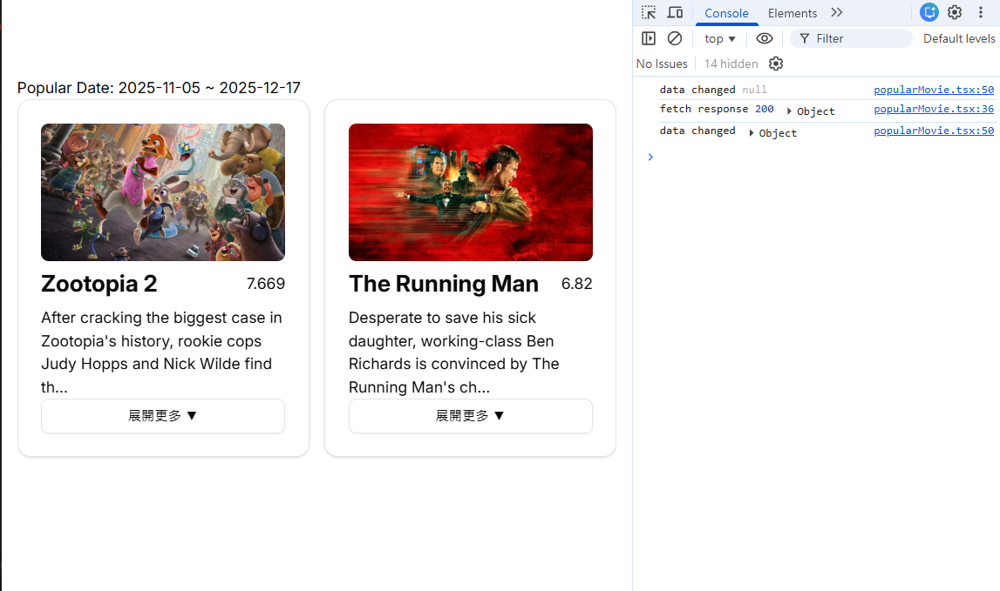

# react-movies

A small React + React Router project for browsing movie data (example / demo).



## 簡介
這個專案以 **React 19**、**React Router 7** 與 **Tailwind CSS** 建構，示範如何與 Movie DB 類型的 API 整合（部分路由與 SSR 支援由 React Router 提供）。
fetch TMDB讀取受歡迎電影資訊，使用shadcn carousel/card 對UI提供友善畫面，在判斷文字長度maxLeng>100收合
## 快速開始

安裝相依套件：

```bash
npm install
```

啟動開發伺服器：

```bash
npm run dev
```

預設會顯示開發網址，或查看終端機輸出的本機位址。

## 常用指令

- 開發：`npm run dev`
- 建置：`npm run build`
- 伺服器（production）：`npm start`
- 型別生成/檢查：`npm run typecheck`

## 環境變數
在根目錄建立 `.env`，加入以下設定以供 API 存取：

```env
VITE_movies_token_auth=your_api_token_here
```

如果沒有設定，部分需要授權的 API 請求會失敗（請檢查瀏覽器控制台的錯誤訊息）。

## 圖片
專案示意圖已放在 `public/12-16_002.png`，並已嵌入於本 README 中。

---
